<h1 align="center">DEX</h1>

去中心化交易所(Decentralized Exchange, `DEX`)是一个点对点市场，交易直接发生在加密交易者之间。DEX 实现了加密的核心可能性之一：促进不受银行、经纪人、支付处理商或任何其他中介机构主持的金融交易。相比以 Coinbase、币安等中心化交易所(`CEX`)，DEX 提供了更好的匿名性与抗审查特性。

尽管如此，CEX 提供法币与加密货币之间的交易，而 DEX 并不允许；相比 DEX，CEX 往往能提供相比 DEX 更好的用户体验，加密货币市场上的大多数交易都是通过 CEX 完成的。

CEX 的所有交易都是由交易所自己通过“订单簿”处理的，该订单簿根据当前的买卖订单确定特定加密货币的价格——纳斯达克等证券交易所使用的方法相同。

### 订单簿

订单簿(Order Book)记录买卖双方对应资产的报价情况。订单簿中有两个角色：

- 做市商，也叫挂单者（Maker）

- 交易者，也叫吃单者（Taker）

CEX 会同时在买卖的两个方向上挂单，根据市场波动调整报价，为交易所提供流动性。提供流动性和提供价格的人是同一人，也就是做市商。中心化交易所掌握着用户的资产与隐私，交易与代币的流通也存在不够透明的问题。DEX 正是为了解决这一问题诞生的解决方案。

从本质上说，DEX 只是一组智能合约。当前的 DEX 并不采用 Order Book 的方式来做市，而是通过算法确定各种加密货币的价格，并使用“流动性池”——投资者锁定资金以换取类似利息的奖励——来促进交易。

实际上，早期的 DEX 也采用订单簿的形式来做市，但以失败告终：每进行一步操作，都要与链上交互。ETH 网络速度慢，gas 贵的问题导致在 ETH 链上做市的效率与成本很不理想。而 CEX 可以做到毫秒级的响应。

经过一系列的探索与发展，一种自动做市逻辑出现了。

在正式了解 DEX 的自动做市逻辑之前，有必要认识几个术语：

- `AMM`：自动做市商

- `Liquidity`：流动性，各项资产的分布情况

- `Liquidity Pool`：流动性池，各种资产对应的资金池

- `LP`：流动性提供者，向 LP 内添加资产的用户

- `Slippage`: 滑点，下单价格与最后成交价格的差额比例

---

## 流动性池 LP

DEX 与 CEX 一个很大的差异在于流动性是由用户来提供的，而不是专业机构担任的做市商同时提供流动性与价格。用户将资产按照一定比例投入流动性池。交易者实际上是与这个流动性池子进行交易。

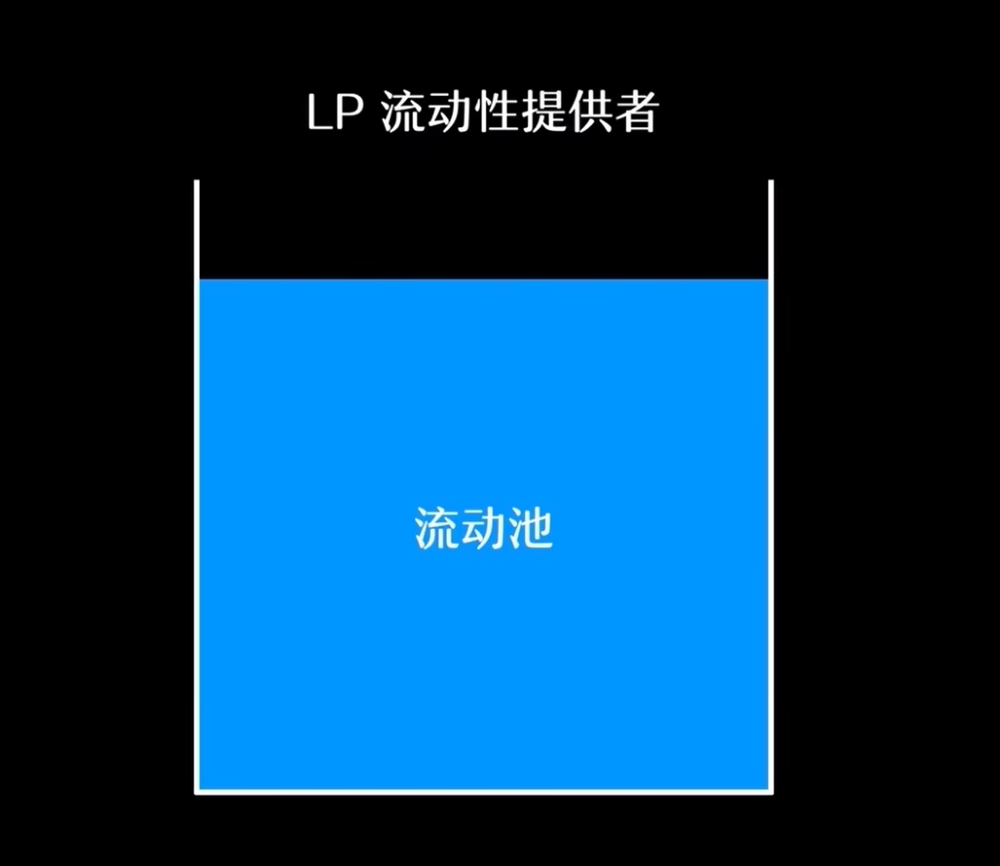

流动性池可以分为几个类型：

- 恒定资产比例：两种资产比例 50：50

- 混合资产比例：支持三种及以上资产

- 加权池：多种资产比例

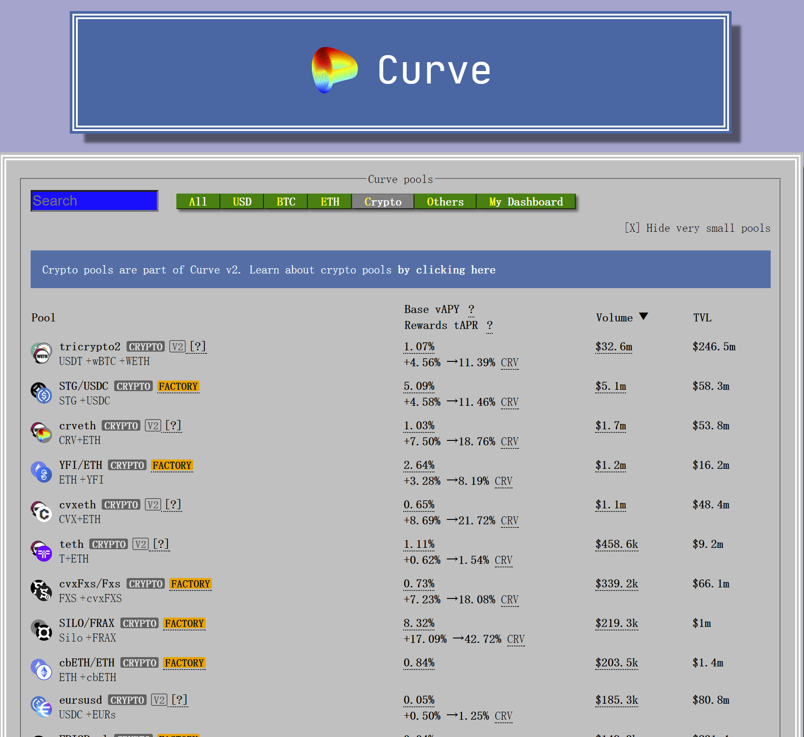

curve支持多种资产比例

LP 将资产按比例向流动性池注入流动性，按照资产占池子的比例获得一定的凭证（LP Token）。LP 根据自己的资金比例收获的交易手续费将累积到 LP Token 中。

### 流动性挖矿

用户提供流动性后获得收益的行为称为流动性挖矿。某些平台还会奖励给 LP 平台的原生代币（比如 Curve 的 CRV)

$$
流动性挖矿收益 = 流动性池交易手续费 + 平台原生代币
$$

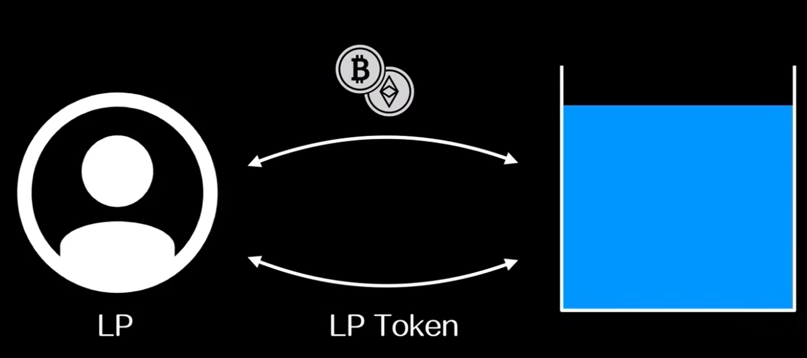

## AMM 模型

AMM 有常见的几种模型：

- 恒定乘积做市商(CPMM)

- 恒定和做市商(CSMM)

- 恒定平均值做市商(CMMM)

- 混合常数函数做市商(CFMM)

DeFi 市场中出现的第一种 AMM 类型是恒定乘积做市商(CPMM)，比如 Uniswap (CPMM + 50: 50 资产价值比例)

#### 恒定乘积做市商 CPMM

普及程度最高的模型

$$
X \times Y = k

$$

X 与 Y 代表流动性池中两种资产的数量，它们的乘积是一个常数 k。

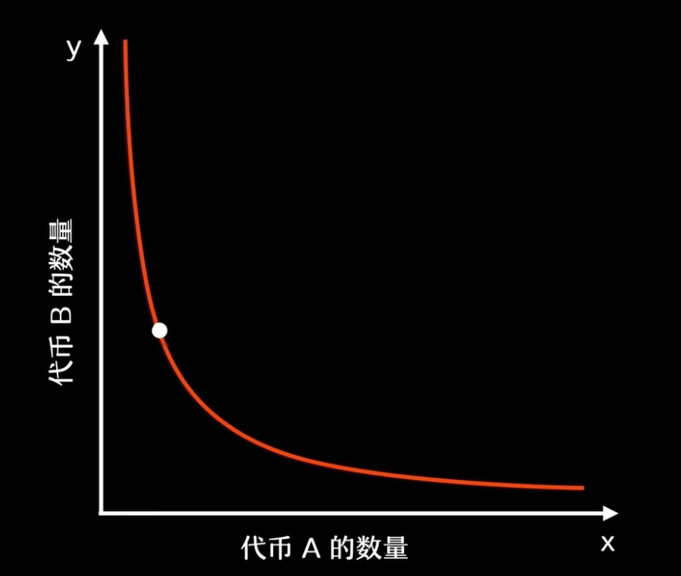

CPMM 模型的流动性总是可用的。但当价格变动越来越大的时候，两端会接近无穷大。

CPMM 的特点：

- 有定价机制，由供需关系决定

- 流动性不会耗尽

- 滑点较高

#### 恒定和做市商 CSMM

$$
X + Y = k

$$

第二种是恒定和做市逻辑，是零滑点交易的理想选择，但可能出现流动性枯竭的情况，允许套利者耗尽其中一种资产。这种情况下，LP 会承受损失，并且交易者将不再有流动性。这种模型并没有被广泛采用。

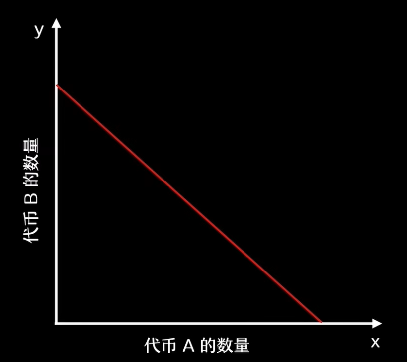

CSMM 的特点：

- 无滑点

- 没有价格发现机制

- 容易发生流动性枯竭

#### 恒定平均值做市商(CMMM)

$$
(X \times Y \times Z \times ...) ^ \frac{1}{N} = k
$$

CMMM 允许创建两种以上资产的 AMM，并在 50：50 以外进行分权。

Balancer 支持混合资产，用户最多可以在资产组合中加入八种资产。

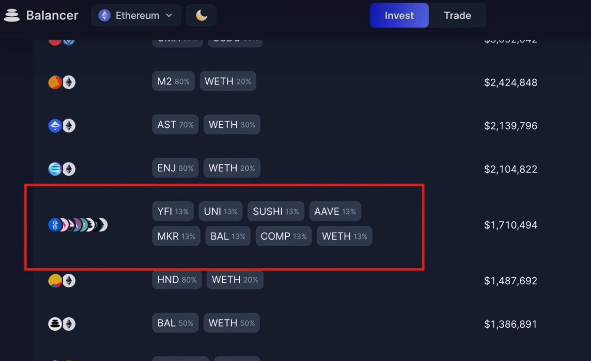

#### 混合常数函数做市商(CFMM)

结合了多种功能与参数,实现特定的行为，如调整 LP 的风险敞口或降低交易滑点。

Curve 的 CFMM 结合了 CPMM 和 CSMM，以保证稳定币交易低滑点与较好的流动性：

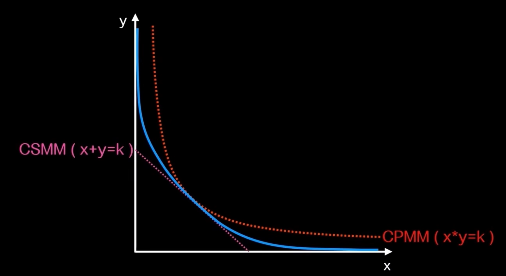

## AMM 的局限

- `无常损失`风险
- 资金效率低
- 多代币敞口风险

#### 无常损失(Impermanent Loss)

场外价格与流动池内对应的价格不一致时，就会产生这种损失。

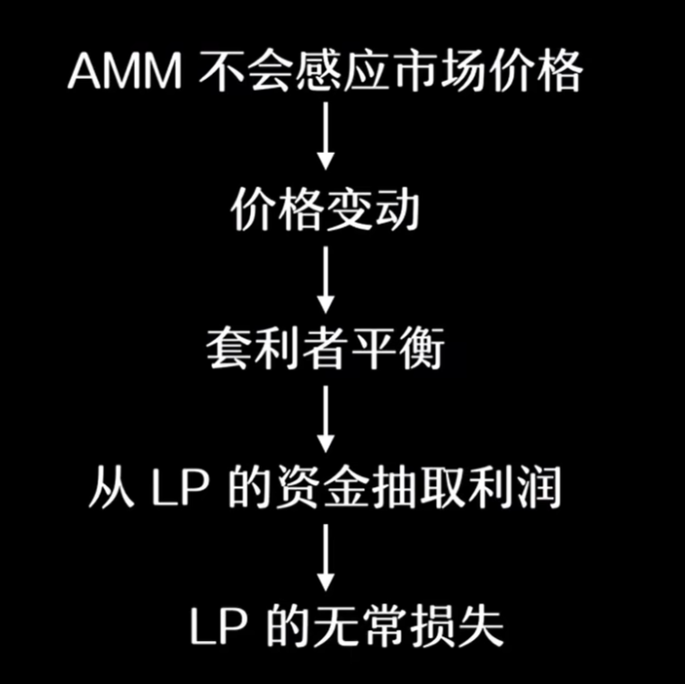

AMM 并不能感应市场价格，当场外价格与流动池内价格不一致，就产生了套利空间。无常损失本质上是套利者的利润。

只要 LP 不取出流动池内质押的资金，无常损失就不会实际发生。当价格恢复到当初质押时的价格，无常损失就会消失，尽管这样的情况比较少见。

##### 无常损失的计算：

w0: 向池子提供流动性的资金

w1: 不成为 LP 的资金：w1

$$
Impermenent Loss = \frac{w0 - w1}{w1}
$$

#### 资金效率低

CPMM 被动做市：

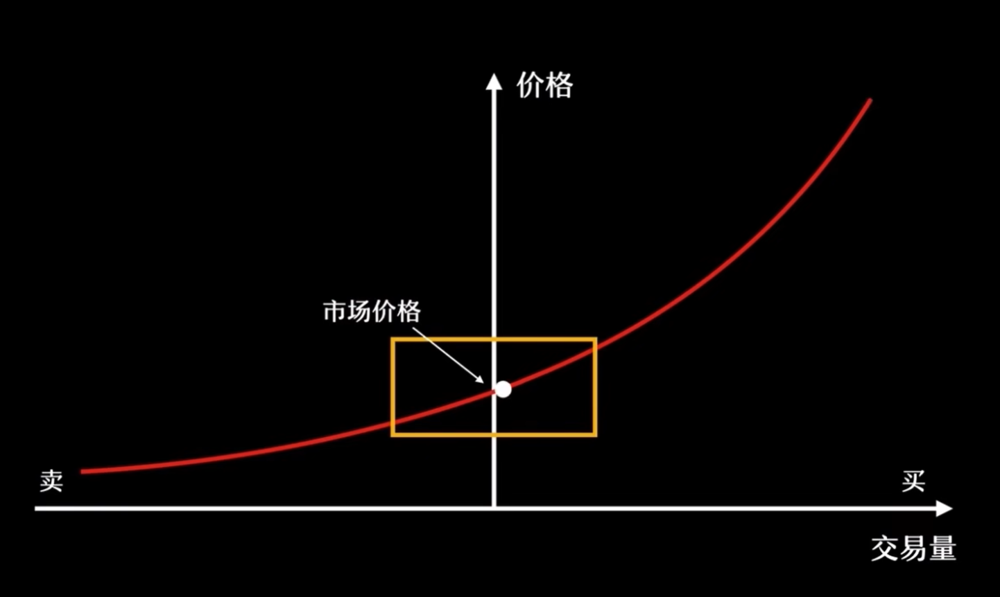

LP 提供的流动性时均匀分布在价格上的，只有当定价区间变化很大时，AMM 的大部分流动资金才能参与交易

这种被动做市的缺点很明显：当交易活跃时，当前价格区间的流动性会迅速枯竭。进一步升高滑点，导致交易停止。被动做市的 AMM 的资金效率非常低。

#### 解决资金效率低的缺陷：

`主动做市`：

Uniswap-V3 可以让用户自主选择流动性分布范围，通过集中流动性，用户会主动分布在资金利用率最高的价格范围(当前价格范围附近)：

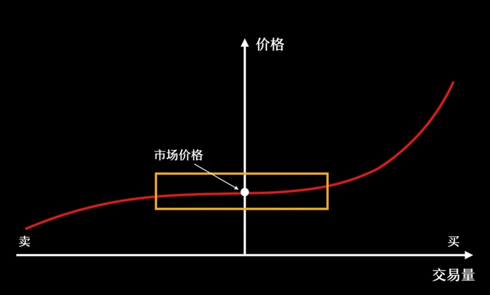

主动做市可以解决资金利用率的问题，不过依然存在缺陷：当价格发生变动时，LP 依然需要根据当前范围频繁主动调整做市范围。

`动态做市`

根据预言机报价，动态调整流动性的分布，将流动性聚集在当前价格附近，无需用户手动操作。

#### 多代币敞口

LP 常常需要被迫购买另一资产以满足流动性资产相对比例的要求，这会增加另一资产的敞口，意味着需要承受多种代币价格波动的风险。Curve，Bancor 允许 LP 在提供流动性时只存入一种代币，提取资金时也可以指定一种代币。

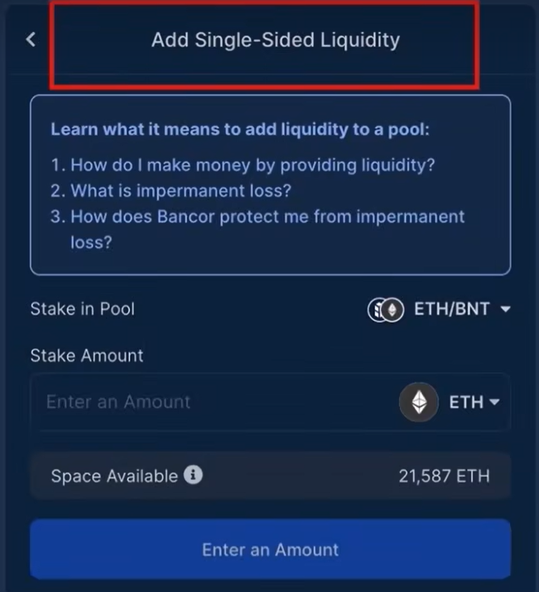
