<h1 align="center">Curve：DeFi世界的造血机器</h1>

`Curve`是DeFi世界规模最大的同质化代币去中心化交易所(DEX)，最初专门提供稳定币或锚定资产货币的做市商交易市场。其锁仓量超过DeFi世界总锁仓量的10%，长期在DeFi的DEX板块排名第一。

`Curve`作为交易所最大的优势是`StableSwap`，即锚定资产的自动流动性提供商。Curve的资金池非常深厚，对于大额稳定币交易，Curve可以提供非常低的价格滑点与低交易费用。除此之外，真正让Curve发挥魅力的地方在于它的整个生态系统中代币经济模型的运转。DeFi项目想要发行代币，吸引流动性，几乎都会选择在Curve上创建流动池。基于这一点，Curve被视作DeFi世界的造血机器，是最重要的基础设施之一。

本节会介绍以下内容：

* Curve的StableSwap曲线
* Curve的代币经济模型与DAO治理
* Curve生态的拓展：Convex

我们先来介绍Curve最专注的领域：稳定币与锚定资产货币。

## StableSwap

Curve最大的优势是低滑点，尤其是大额交易。在DeFi世界的交易如果涉及大额稳定币或锚定资产货币，Curve是最理想的交易所。

如果AMM的流动性池的深度很浅，那么当前报价的流动性会很快枯竭，容易造成高滑点交易。为实现大额锚定资产的低滑点交易，同时保证流动性，Curve调整了自己的做市曲线：

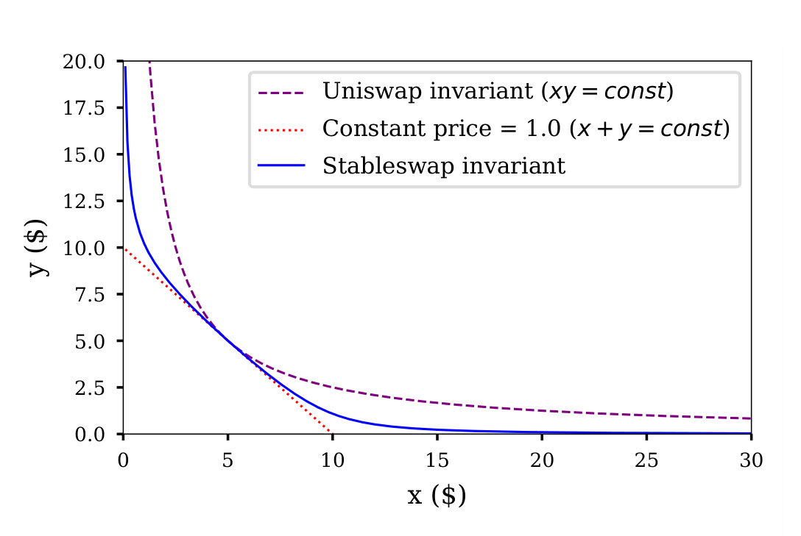

图中紫色的曲线是CPMM做市曲线，流动性优秀，但滑点较高，被`Uniswap`采用。红色的曲线是CSMM，无滑点，但容易发生流动性枯竭。蓝色的Curve的做市曲线介于两者之间，保证了稳定币的交易的低滑点的同时流动性不会枯竭。

做市曲线的斜率的相反数$-\frac{d_Y}{d_X}$即是代币$X$的价格，对于恒定和模型CSMM，代币的价格是恒定不变的。这对于稳定币交易非常有利，代价是流动性随时可能枯竭。一个简单的解决方案是引入价格预言机来实时调整恒定和的常数$K$，但这带来了额外的风险，且显著降低了去中心化程度。

对于恒定积模型(CPMM)，流动性池中的代币价格（以$X$为例）$P_X$很容易推导：

$$
X \times Y = K \\
P_X = -\frac{d_Y}{d_X} =\frac{K}{X^2} = \frac{Y}{X} 
$$

恒定积模型赋予了市场价格发现机制，即代币价格只和供需有关。LP向流动性池子提供流动性只会改变常数$K$的大小，无论价格如何变动，代币$X$与代币$Y$的价值比依然是1:1，即投入流动性的时刻的价值比。简单的恒定积模型牺牲了交易滑点，价格的大幅变动意味着LP需要承受较大的无常损失。

假设$X$ 与$Y$价格相等时，总数为$D$，对于恒定和模型有：

$$
X + Y = D
$$

对于恒定积模型有：

$$
X \times Y = (\frac{D}{2})^2
$$

Curve的做市曲线是这样构建的，给恒定和模型两边乘上$\chi D$，加到恒定积模型上：

$$
\chi D(X + Y) + X Y = \chi D^2 + (\frac{D}{2})^2
$$

其中$\chi$是一个无量纲的变量：

$$
\chi = \frac{A XY}{(\frac{D}{2})^2}
$$

这里的$A $可以看作一个增益系数，这个增益系数决定了做市曲线中心的平坦度。简单地说，$A$越大，围绕当前价格的流动性集中程度就越高，做市策略越接近恒定和模型。

这里只考虑只有两种代币$X$与$Y$流动性池，读者可以自行延拓至N种代币。

## Curve的代币经济模型

Curve平台币`CRV`：同时拥有积累价值与投票的功能。

`CRV`总量为30.3亿个，其中62%分配给LP，流动性挖矿中的5%分配给`CRV`推出之前的LP，这5%有一年的解锁期。62%中的57%会在未来6年多时间内逐步释放给LP；总量中的30%分配给创世团队与投资者（解锁期为2~4年）；3%分配给Curve员工（2年的解锁期）；5%用作社区储备。每天可以挖到约75万个`CRV`，根据比例分配在每个池子里。

`veCRV`（Vote-Escrowed CRV）是Curve平台的投票托管代币，不可交易，是`CRV`锁仓后的凭证。一个`CRV`锁仓4年可以获得1个`veCRV`，锁仓时间越长，得到的`veCRV`就越多：

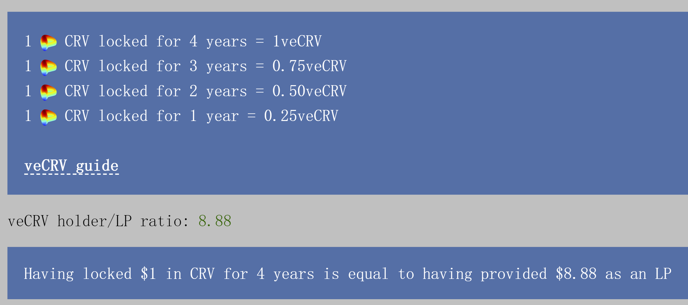

`veCRV`主要有四个用处：

- 投票

- (Base vAPY) 获得全平台对应比例的所有交易费的50%分红，以`3CRV`的形式累积给用户

- (Rewards tAPR) 流动性挖矿的奖励提高，最高2.5倍

- 获得一些项目的代币空投

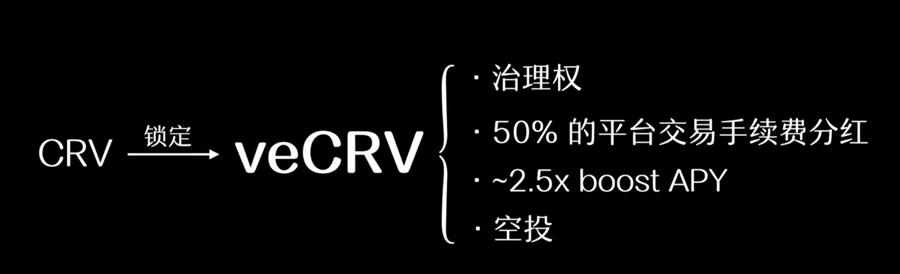

`3CRV`是Curve知名的`3pool`的LP凭证。用户在提取收益时，可以将`3CRV`兑换成任何一种稳定币资产：

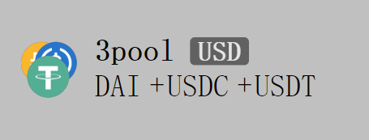

锁仓凭证`veCRV`虽然不可交易，但Curve为其赋予了价值：

$$
veCRV = 治理_{(投票权)} + 收益_{(3CRV + ~2.5 \times boost APY + Airdrop)}
$$

***

#### 投票

我们先来看投票的职能：

Curve的DAO投票采用了时间权重的机制，权重与`veCRV`s锁定时间正相关，锁定时间有一个上限$t_{max}$：4年。投票的权重可以表示为：

$$
vote\  weight = a \frac{t}{tmax} 
$$

$t$是锁定时间，$a$是锁定CRV的金额，$t_{max}$为4年。投票的权重会随着时间递减，鼓励用户持续锁仓`CRV`来维持`veCRV`投票的作用。

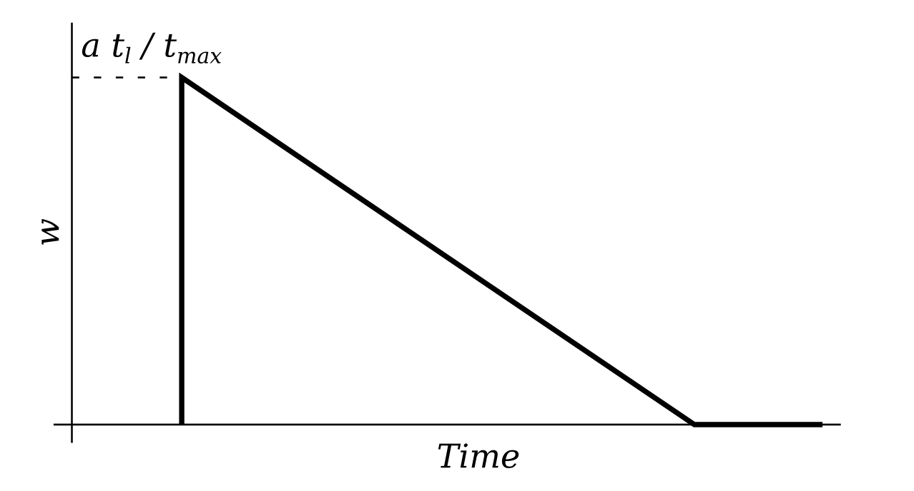

每10天，`veCRV`的持有者都会对Curve的资金池进行一次投票，得票高的池子会获得更高的`CRV`奖励分配：

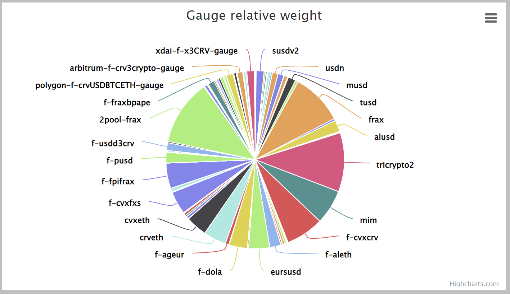

一个DeFi项目想要活下来，拥有雄厚的流动性是必要条件，靠流动性激励吸引用户。任何拥有2000个`veCRV`的人都可以在Curve DAO上发起提案。项目方可以通过这个方法吸引用户为自己的代币提供流动性，这也是“造血机器”称号的由来。

***

#### 价值积累

如何理解`CRV`的价值流通呢？LP通过向流动性池注入资金提供流动性来获得一定的APY奖励。APY奖励有一个范围，可以通过锁仓`CRV`来获得`veCRV`来加速收益。

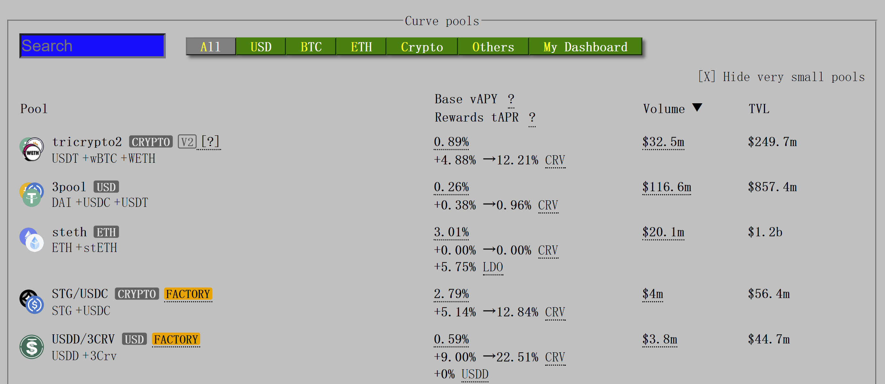

一方面，`veCRV`的价值是靠`CRV`锁仓换来的，这使得`CRV`在公开市场上变得稀缺。另一方面，`veCRV`的效用是随时间衰减的，用户想要高收益就要持续锁仓CRV来维持veCRV的作用，这也增强了CRV的持有者的粘性。Curve的代币经济系统是一个自我强化的循环。

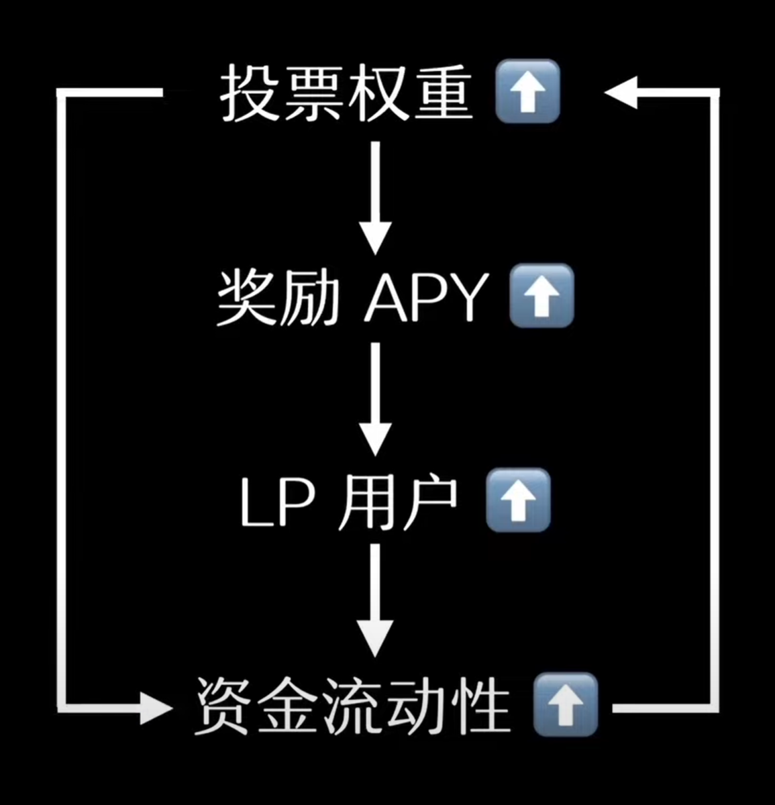

*** 

## Convex: Curve生态的拓展

Convex的核心创新点是把Curve的`veCRV`的治理权与收益权分离，分离成两种Convex平台代币`vlCVX`和`cvxCRV`。

 
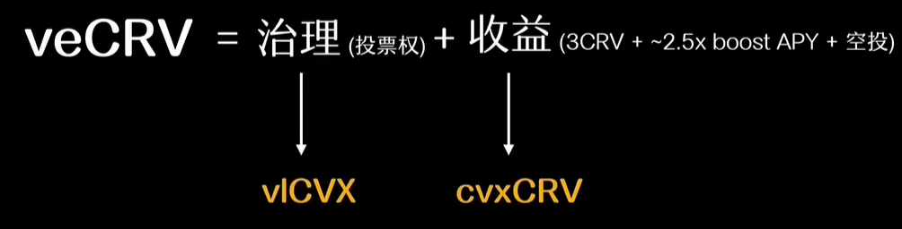

对于Curve的LP，通过质押`CRV`在Convex可以获得`cvxCRV`代币，这种质押是不可逆的。`cvxCRV`质押在Convex平台可以获得比Curve更高的收益，但需要放弃`veCRV`的治理权。

`cvxCRV`比Curve多出的收益是用户可以获得Convex平台所有资金池的boost APY 的10%以及`CVX`代币奖励：

 
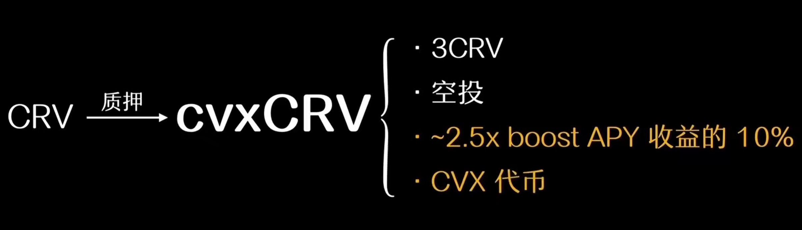

Convex会同步显示Curve资金池的信息，允许Curve的流动性提供者将Curve池的LP tokens质押在Convex上获得更高的APY以及`CVX`奖励。

Convex收获用户质押的CRV之后将其锁定获得`veCRV`，Convex持有的大量`veCRV`赋予了其极高的投票权重，用投票获得的boost奖励与自己的平台代币`CVX`回馈Convex用户：

 
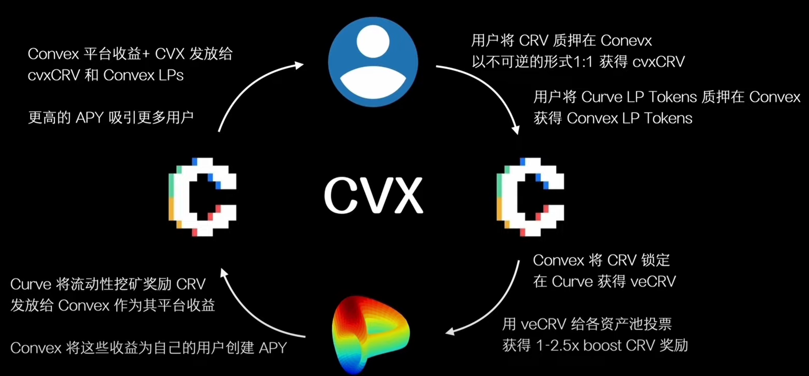

---

刚才提到Convex将`veCRV`的收益功能与治理权力分离。想要获得更多收益的用户选择将`CRV`质押在Convex获得`cvxCRV`，期望获得更多投票权力的用户可以质押`CRV`16周获得`vlCVX`（Vote-Locked CVX）凭证，获得的平台收益比`cvxCRV`略高，且拥有Convex的治理权。Convex的治理权不仅包括平台内部的提案投票，还允许用户参与分配`veCRV`的投票权。

 
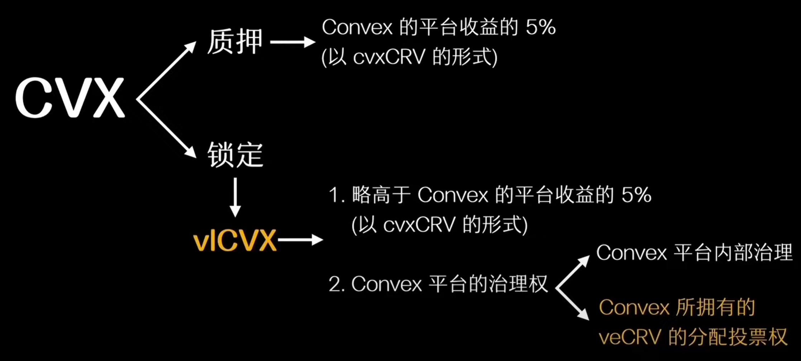

时至今日，Convex的拥有的`veCRV`已经超过一半，拥有更多的`veCRV`就意味着拥有更多的投票权，拥有更多的“支配流动性”的权力。Convex平台上的`vlCVX`持有者对Curve的资金池权重仪表盘的话语权已经占据支配地位，指挥`veCRV`奖励的流向的权力已经落在Convex手里。大量的项目选择购买大量的`CRV`质押在Convex平台获得`vlCVX`为自己的资金池投票。

---

Curve与Convex生态涉及的概念与代币种类繁多，为初学者设置了一些障碍。这里贴出一张图来总结Curve与Convex生态最核心的部分：

 
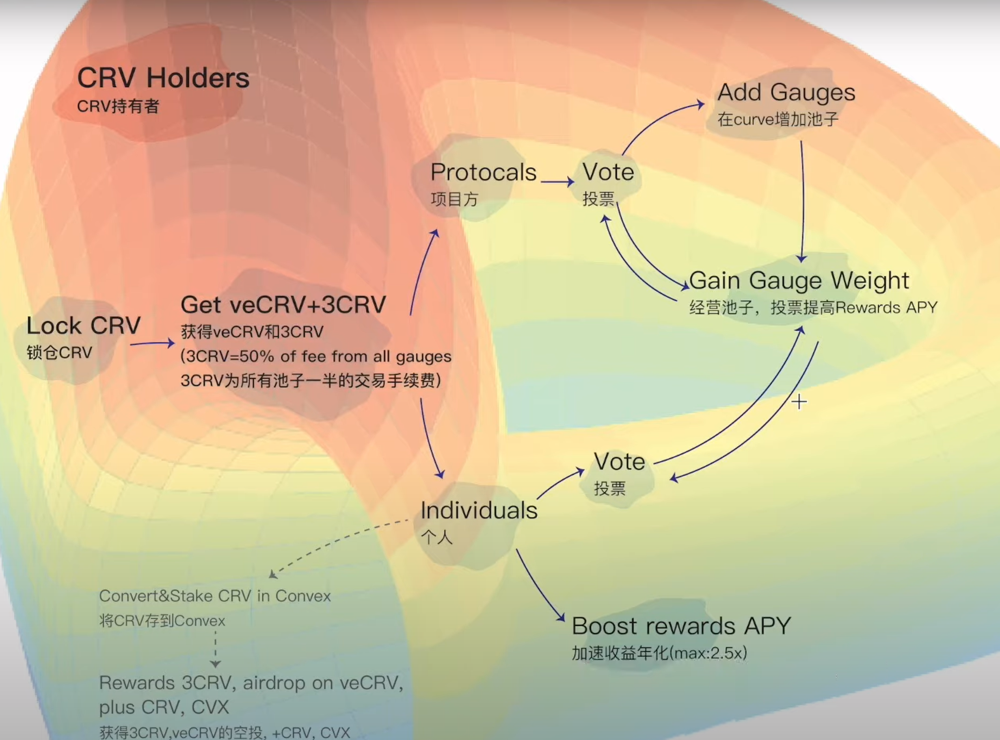

