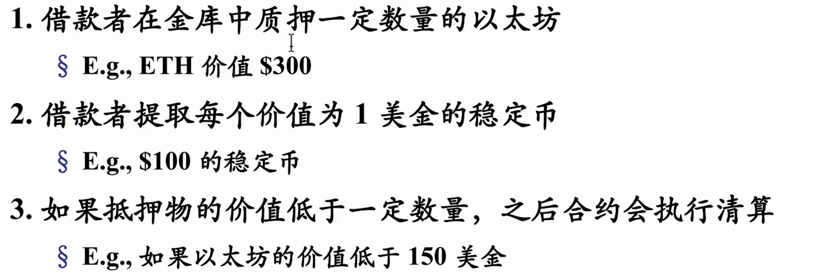
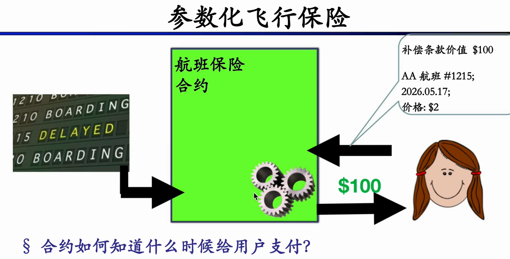
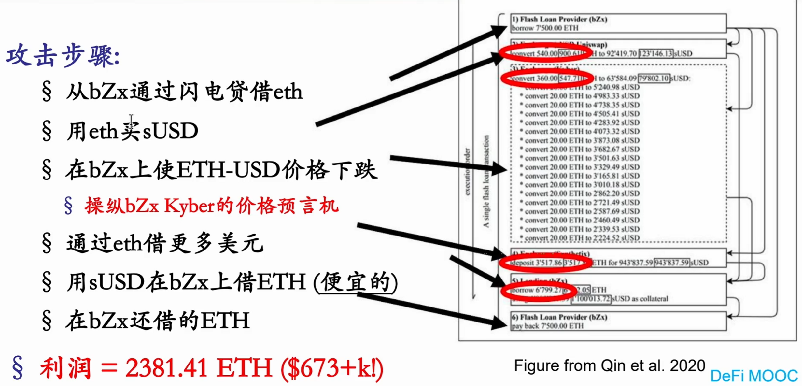
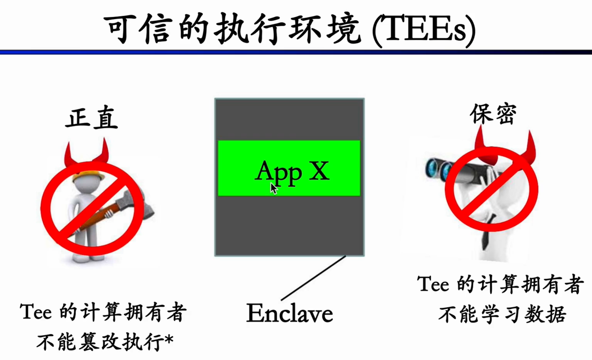

<h1 align="center">预言机</h1>

预言机是一种智能合约接受外部数据的第三方服务，是一个将数据中继上链的链下平台。

区块链并未与互联网连接，很多协议需要接受外部数据。预言机就在这些场景发挥作用。

## 典型的应用场景：

### 超额抵押型借贷协议

合约需要知道抵押代币可以兑换多少稳定币，以及何时执行清算。

### 参数化保险

### 其他应用：

- 赌博应用，e.g.赌球
- 包装的加密货币
- 合成资产
- DEX实时报价降低套利空间

实际上，几乎所有的DeFi应用都用到了预言机。 

## 预言机的基础设计

从链下向链上传输可信数据并不是简单的事情，需要面临诸多问题：

- 恶意数据
- 发送数据的节点可能宕机
- 链下数据服务器宕机

针对稳健性与隐私的考验，预言机系统设计了一个分布式网络，节点之间需要一个拜占庭容错机制达成共识或合并报告；发送到区块链数据的节点需要多个备份；抓取多个网站的数据来避免链下数据服务器宕机。

## 预言机攻击

经典案例：bZx价格预言机攻击

## 预言机隐私保护

  
