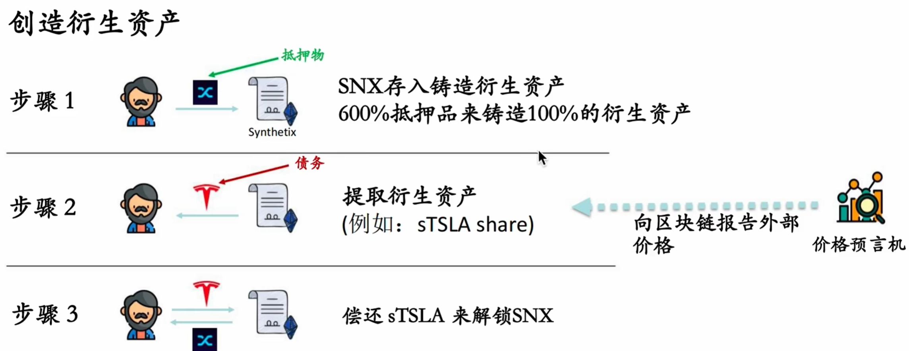

<h1 align="center">合成资产与衍生品</h1>

## 传统金融衍生品

一般根据另一类资产的未来价格有条件地支付，比如期货，期权和远期合约。

针对传统金融的衍生品，需要注意的是：

- 为什么这么设计？

- 合约是否有杠杆？

- 如何管理风险？

#### 期货与远期合约

远期合约是在未来某个时间，按照某个价格购买一定数量的商品或资产的承诺。

- 定制化，在柜台交易（OTC）

- 到期之前没有资金还手

- 交易对手方风险很高

期货是一种以市场价计价的标准化远期合约，没有对手方风险。所有的合约对手方都是交易所。

为了防止违约，有保证金机制与市价计价机制：

#### 为什么要这么设计期货合约？

本质上，期货是风险厌恶者出售给风险偏好者的资产。

#### 掉期合约（互换合约）Swaps

一种内交易双方签订的在未来某一时间相互交换某种资产的合约。交易的对象可以是货币，债券，利率，汇率和价格指数等。

市场空间很大，由国际掉期与衍生工具协会（ISDA）监管，大机构与 ISDA 签订主合约。

典型的掉期合约有：

- 固定收益交换浮动收益
- CDS 信用违约掉期
- ERS 股权回报掉期

#### 为什么这么设计掉期合约？

- 交易者想要购买但是购买标的太贵

- 只交换现金流：更低的交易对手方风险

- 可灵活构建合成资产。

## 合成资产

如何设计一种合成资产？我们需要考虑以下几点：

- 识别可能面临的金融风险
- 判断/衡量风险变化的稳健方法
- 如果没有人拥有真正的合成资产，如何确保支付
- 如何保证市场流动性

一个经典的例子：Synthetix

Synthetix 是一个合成资产协议，为链下资产映射到链上提供支持：

用户在交易所购买 Synthetix 的原生代币 SNX，通过超额抵押的方式获得是 sUSD，消费 sUSD 后赎回 SNX。不仅是 sUSD 这样的法定资产，Synthetix 提供了很多资产选择：

通过 Synthetix 这样的衍生品协议，我们可以在链上购买链下的资产，比如用加密货币购买特斯拉的股票：

sTSLA share 并不是真正的特斯拉股票，而是其在链上的映射。

像 Synthetics 这样的衍生品协议为用户带来了什么好处

- 无限的流动性且没有滑点

- 不需要对手盘

- 风险分担

对于风险分担这一点，Synthetix 采用了一种非常复杂的动态债务池机制，需要一个简单的例子来帮助理解：

即使 Bob 不投资，仍然持有 sUSD，在 BTC 币价上涨后，依然需要承受损失。也就是说，如果持有 sUSD 不行动，相当于做空债务池中其他用户的投资策略。假如 BTC 价格下跌，持有 sUSD 的 Bob 会获得收益。
