<h1 align="center">借贷</h1>

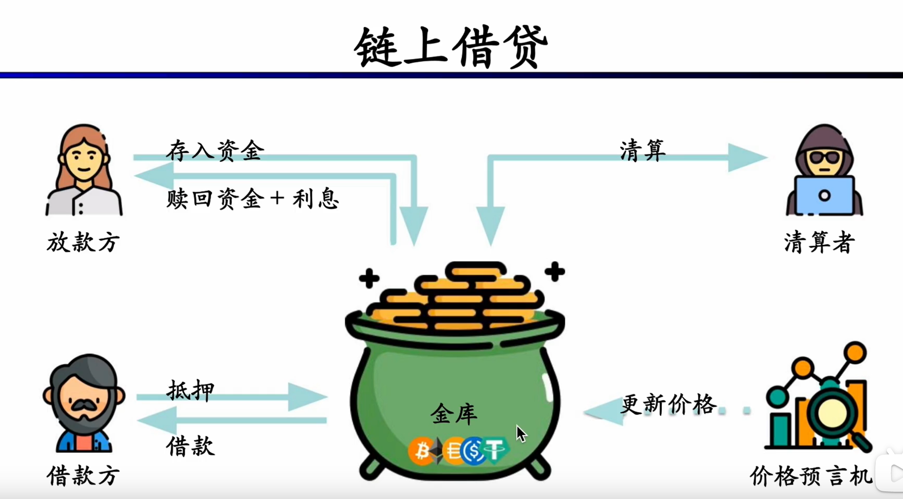

### 基本术语：

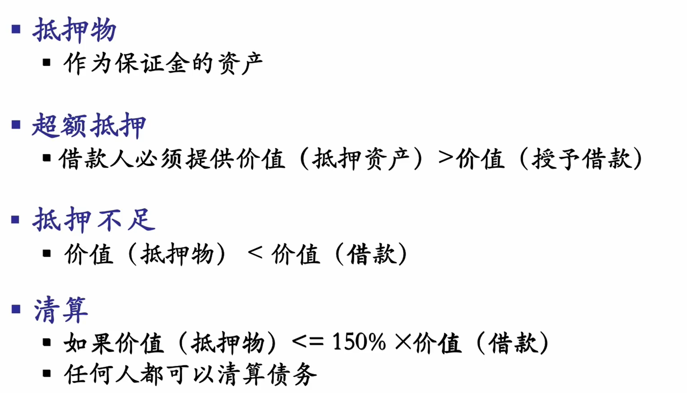

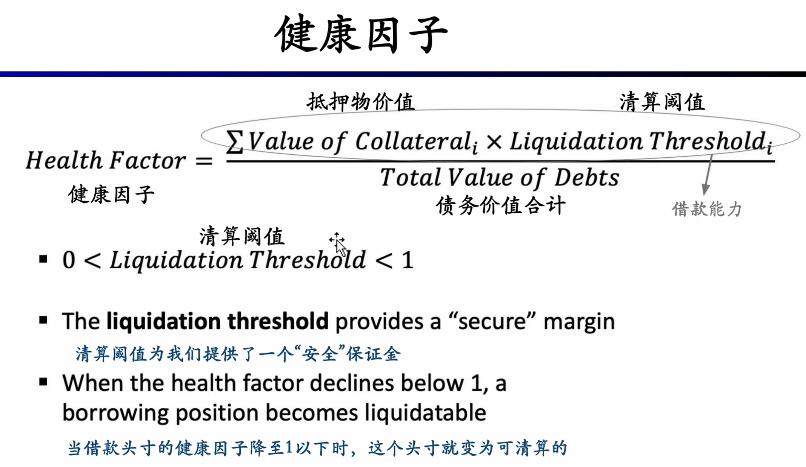

清算过程任何人都可以发起，获得相应的清算奖励。但清算常常不是立即发起的，延迟48小时或72小时是常见的策略。在这个窗口期内，借贷者可以完成补仓操作。这对借贷方来说可以避免巨大的损失，协议方也可以规避巨大的波动。

关于清算需要了解的一些术语：

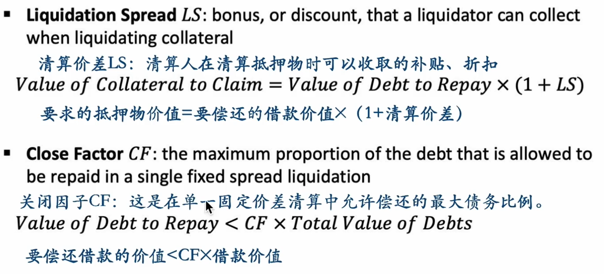

清算价差是激励清算者的机制，关闭因子一般被设置为一个常数，比如0.5，这意味着清算人最多可以偿还50%的债务。

## 超额抵押借贷

## 不足额抵押

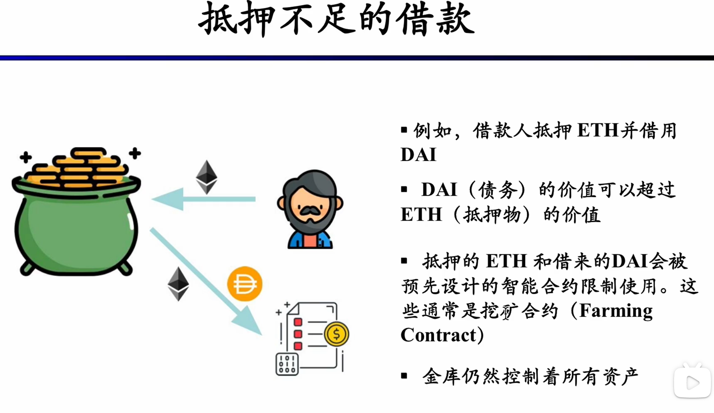

拉高杠杆的不足额抵押借款已经被市场抛弃。究其原因是风险偏高：一旦债务币种价格升高，不足额抵押借款的收益很可能转负。此外，借债智能用来做智能合约允许的事情（比如参加流动性挖矿）。流动性挖矿有无常损失，且获得收益较慢。在较长的时间范围内，债务资产的币价波动很可能导致借款人被清算，即使不被清算，本金亏损的情况也常常发生。

# 清算

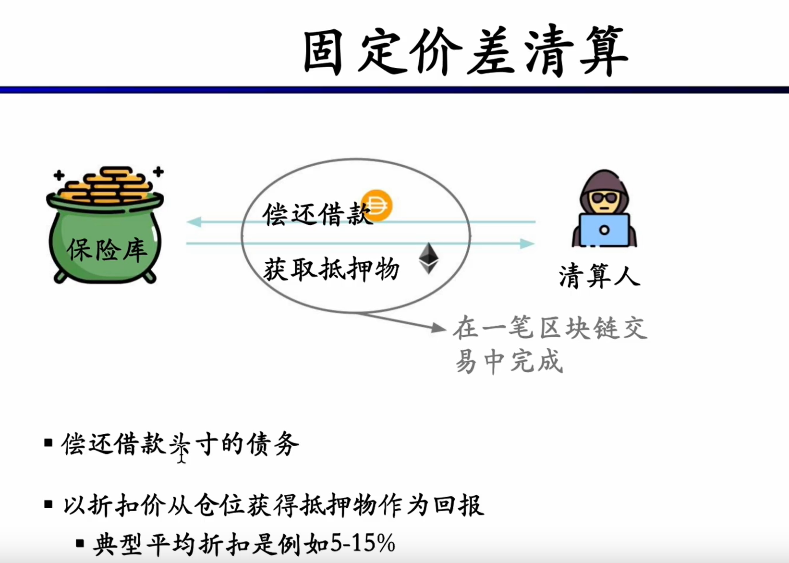

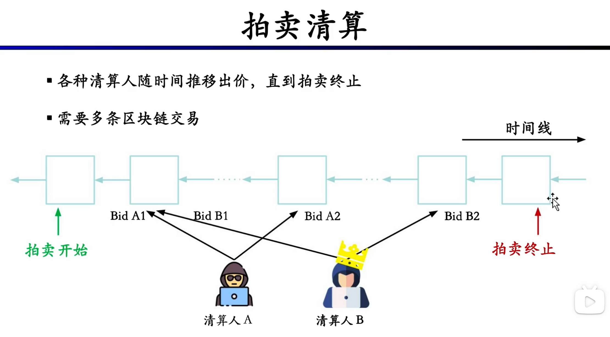

英式拍卖：固定时间内出价高者得

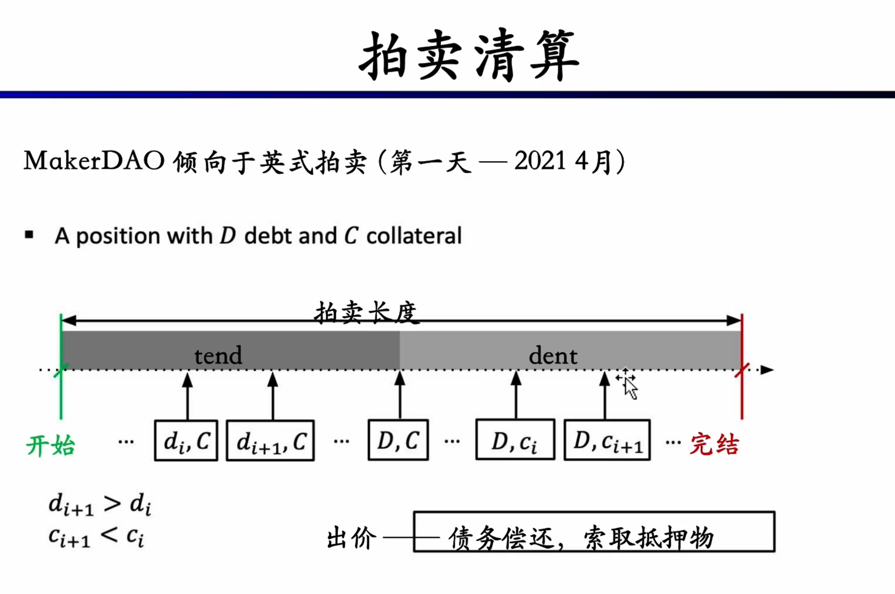

拍卖清算会分成两个部分：账面阶段与还款阶段。在账面阶段，清算人出价的偿还债务越来越高；偿还阶段，索取抵押物的比例越来越低。债务D需要全部偿还，但只能获取一部分抵押物。

荷兰式拍卖：一笔交易中立即结算

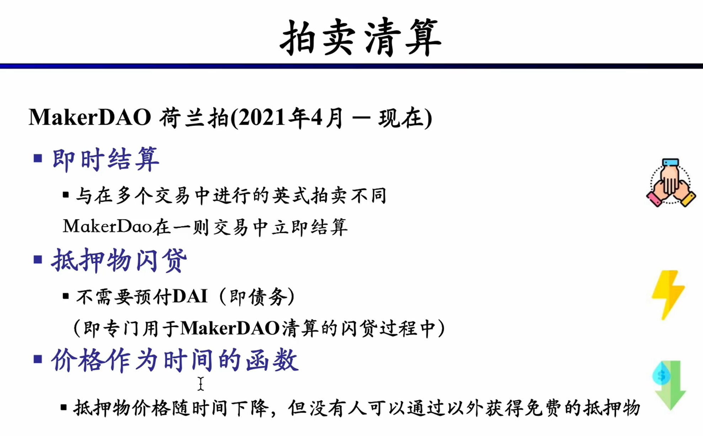

目前清算工作已经完全由智能合约来完成。

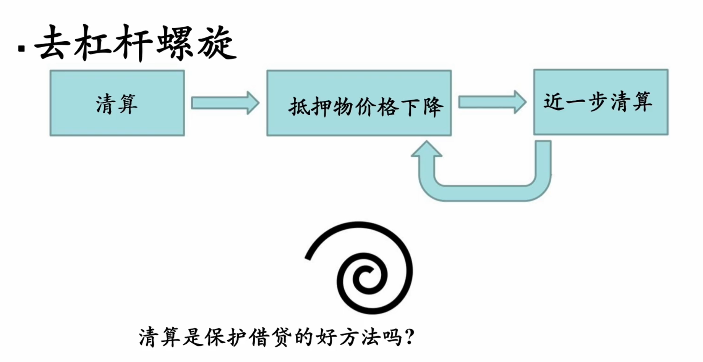

清算过程对抵押物价格的下跌是正反馈的，进而引发进一步的清算与抵押物价格下跌。

## 闪电贷 (flash loan)

智能合约的特性为用户提供了闪电贷的能力，这在传统金融中是不可能出现的。

闪电贷要求一笔借贷在一个原子交易内完成。借贷人获取一笔无需抵押的贷款，完成一系列操作之后（大部分是套利操作），在同一笔交易内偿还本金、利息与gas即可完成闪电贷。

假如偿还失败，该笔交易会回滚，相当于这笔交易并没有发生，这对于借款的协议来说，并无风险。

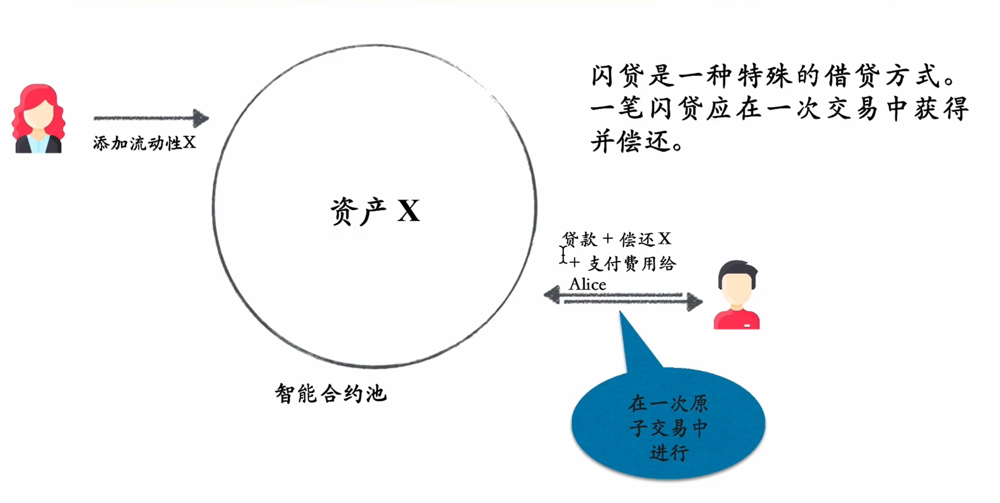

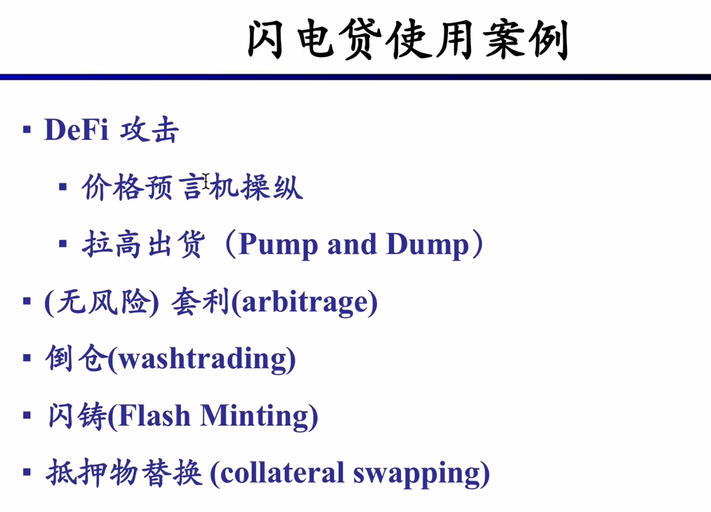

当前利用价格预言机进行DeFi攻击的行为已经不再常见了。合约部署方可以这样防范攻击：

> 现在很少听到通过闪电贷通过预言机操纵攻击了，不是因为Chainlink的普及，而是一个合约部署方在使用预言机方式上的一个小改进，就是对价格做一个小延迟。闪电贷必须在一笔交易中完成，因此黑客对预言机价格的操纵也必须在同一笔交易里完成。所以如果我们的喂价，是用上一个时刻的价格，会怎么样呢？黑客用闪电贷把某币的价格从1刀拉到了10000刀，企图以10000刀进行交易，但结果他进行的这笔交易是用上一个时刻预言机产生的价格，那他的攻击就无法进行了。

### 闪电贷如何套利：

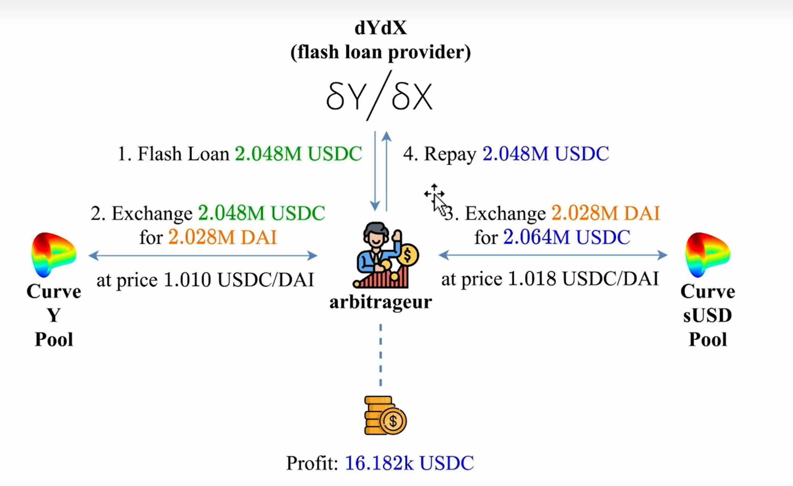

不同的池子之间存在价差（套利空间），从dYdX借出一笔大额USDC，从低价池子中购买DAI，在高价池子中卖掉DAI换回USDC，其中的差价减去借贷利息与gas就是此次闪电贷的利润。

